# LearnRush

This repository contains the day wise deliverables 

## 📌 Week 1 — Engineering Mindset Bootcamp

**🟦 DAY1 — SYSTEM REVERSE ENGINEERING + NODE & TERMINAL**

~ Sysinfo.js is a script that prints the hostname, available disk space, top 5 open ports, default gateway and count of logged-in users

~ Created 3 shell aliases named gst,files and ports for git status, ls -lha and lsof -i -P -n | grep LISTEN  respectively (Screenshot attached in the folder)

To verify this, run(in terminal):  

alias

type alias_name

Reminder - Before creating aliases, check your current shell by "echo $SHELL"   

  

~ Ran a node program named runtimeMetrics.js and captured its runtime metrices using process.cpuUsage() and process.resourceUsage()

**🟩 DAY2 — NODE CLI & CONCURRENCY**

CLI Tool-Stats.js

Features: 

-Counts lines, characters, and words

-Processes 3 files in parallel using promise.all

-Outputs performance metrics

-Optional: duplicate removals

Command to run : node stats.js --file filename.txt  (this will process the file and add the performance metrices to log)

To process files and remove their duplicate lines : node stats.js --file filename.txt --unique true   (After this the modified files will be added to the output folder)       

**🟨 DAY3 — GIT MASTERY (RESET + REVERT + CHERRY-PICK + STASH)**

~ Syntax error was inserted in the program as a bad commit out of 10 commits and used git bisect to detect the first bad commit  

Command : To start bisect-  git bisect start 

To stop bisect- git bisect reset

~ Created new branch release/v0.1 from older commit using  git checkout -b release/v0.1 commitHash

[commithash can be found using:  git log -oneline]

~ Cherry picked the commits from the main branch to release branch. First switch to release branch

Command used: git cherry-pick 1commitHash 2commitHash....

~ A new commit was made in the program and pushed in the stash and the branch was switched but the commit remained in the stash and finally the commit was restored using git stash apply

~ Created commit graph using: git log --graph --all show

  

**🟥 DAY4 — HTTP / API FORENSICS (cURL + POSTMAN)**

~ Logged the response headers into curl-headers.txt using:  curl -I https://api.github.com/users/octat > curl-headers.txt

~ Analyzed paginated responses of 3 pages and link headers by fetching https://api.github.com/users/octocat/repos?page=1&per_page=5

Conclusion: Logged each pages's relation with other pages. However Page3 contains an empty body because the last relation pointing to page2 confirms that page2 is the final page with results and page3 is beyond the dataset.

~ Created and exported that collection to test *GitHub user endpoint  *Repositories across pages

~ Server.js is build to return timestamp,request headers and maintain counter in memory using endpoints: /ping,/headers and /count respectively

To test run: http://localhost:3000/ping

http://localhost:3000/headers

http://localhost:3000/count

**🟪 DAY5 — AUTOMATION & MINI-CI PIPELINE**

~ healthcheck.sh pings your sever every 10sec and also log the timestamps during the failure into the logs folder  

Check private ip address of sever: ip a OR hostname -I

For private ip address of sever: curl ifconfig.me

~ Created pre-commit hook using Husky which checks that .env file does not exist in git, Js is formatted and ensure log files are ignored.

  

  

~ Generated archive: bundle-<timestamp>.zip which includes source code, logs, docs and SHA1 checksums  (To create checksum file: sha1sum src/* > checksums.sha1)

Commands to run build bundle : TIMESTAMP = $(date +%Y%m%d%H%M%S)      

#to generate timestamp:  zip -r bundle -$TIMESTAMP.zip src logs docs checksum.sha1

~ Scheduling to run healthcheck.sh to run every 5 min using cron. To edit crontab run : crontab -e but first make the healthcheck.sh executable using chmod +x healthcheck.sh

  

## 📌 Week 2 — Frontend (HTML, CSS, JS)

**🟦 DAY1 – HTML5 + Semantic Layout**

### Exercise

Built a Blog Page using only semantic HTML (no CSS).

### Key Learnings

- Importance of semantic tags like `header`, `nav`, `main`, `section`, `article`, `aside`, and `footer`
- How semantic HTML improves accessibility and SEO
- Structuring content without relying on generic containers
- Basics of building accessible forms
- Understanding document flow before applying styles

### Notes

- No CSS was used — focus was on structure and semantics.
- Accessibility considerations were included where applicable.

**🟩 DAY2 – CSS Layout Mastery (Flexbox + Grid)**

### Exercise

Replicated a UI screenshot provided by mentor using Flexbox and CSS Grid.

### Key Learnings

- Difference between Flexbox (1D layout) and Grid (2D layout)
- Building responsive layouts without frameworks
- Handling spacing, alignment, and layout flow
- Importance of mobile-first design strategy
- Practical understanding of CSS responsiveness

### Notes
- Focus was on layout techniques using Flexbox and Grid.
- Responsiveness tested across different screen sizes.

  

**🟨 DAY3 – JavaScript ES6 + DOM Manipulation**

### Exercise

Built an interactive FAQ accordion using JavaScript (click to expand).

### Key Learnings

- Writing cleaner code using ES6 features
- Understanding event-driven programming
- Selecting and updating DOM elements dynamically
- Managing UI state using JavaScript
- Improving interactivity without external libraries

### Notes

- Focus was on core JavaScript fundamentals and DOM APIs.
- No frameworks were used — pure JavaScript implementation.

  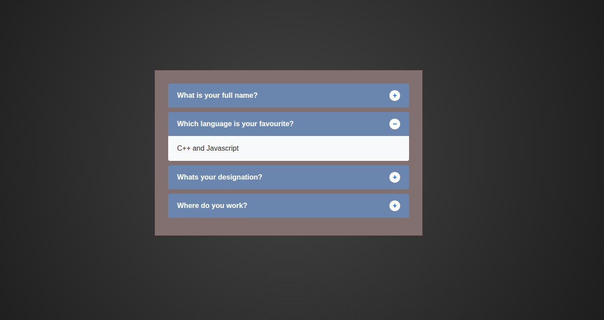

**🟥 DAY4 – JS Utilities + LocalStorage Mini-Project**

### Exercise
Built a Todo App with LocalStorage persistence.

Features:
- Add tasks
- Edit tasks
- Delete tasks
- Add sticky notes
- Persist data after refresh

### Key Learnings

- Structuring reusable utility functions
- Persisting application state in the browser
- Debugging JavaScript effectively using DevTools
- Handling runtime errors gracefully
- Building small stateful applications without frameworks

### Notes

- Focus was on building a functional mini-project with persistence.
- Emphasis on clean utility functions and debugging workflow.

  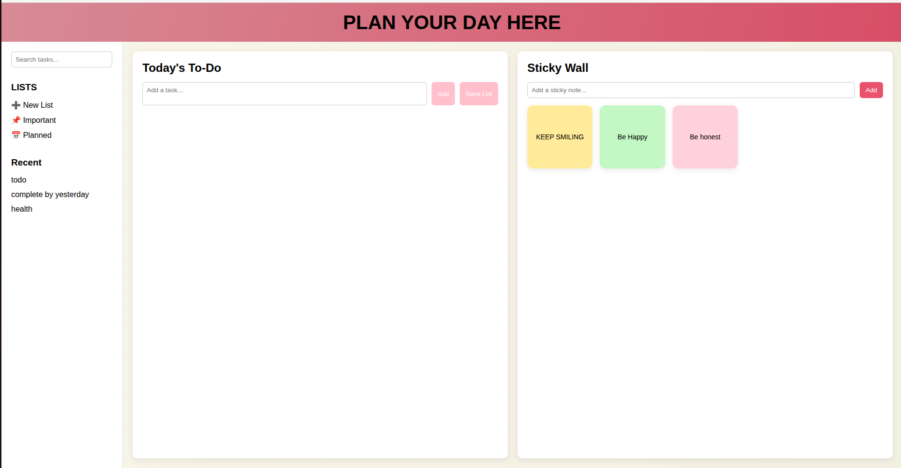

**🟪 DAY5 – Capstone UI + JS Project**

### Exercise

Built a mini “E-commerce product listing page”.

### Key Learnings

- Fetching and rendering API data dynamically
- Managing UI state with search and sorting
- Structuring a multi-page frontend project
- Building responsive layouts
- Integrating all frontend fundamentals into a single project

### Notes

- Focus was on combining layout, interactivity, and data fetching.
- Emphasis on clean UI and responsiveness.

  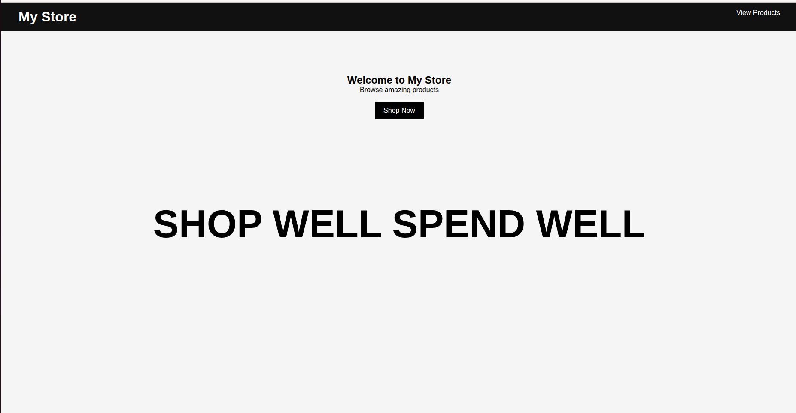

  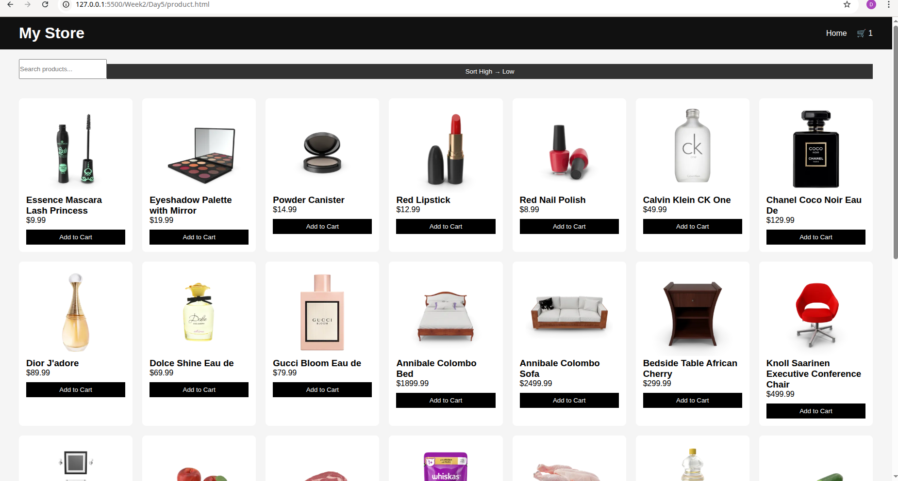

  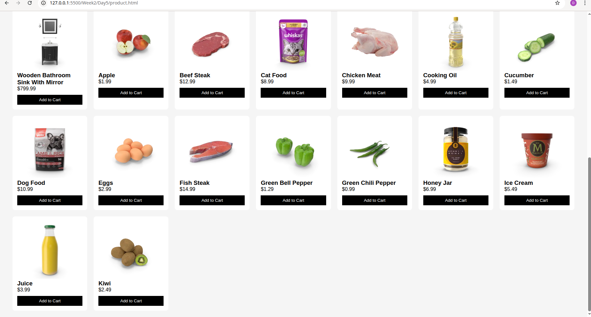

## 📌 Week 3 – Frontend Advanced

**🟦 DAY1 — TailwindCSS + UI System Basics**

### Exercise

Built a Dashboard Layout skeleton including header and sidebar.

### Key Learnings

- Setting up Tailwind in a Next.js environment
- Using utility-first styling effectively
- Structuring reusable UI components
- Understanding layout composition with header and sidebar
- Working with custom design tokens via theme configuration

**🟩 DAY2 — Tailwind Advanced + Component Library**

### Exercise

Built a component library using reusable UI components and reused the Day 1 sidebar and header.

Components created in:
/components/ui/

- Button.jsx
- Input.jsx
- Card.jsx
- Badge.jsx
- Modal.jsx

### Key Learnings

- Designing reusable UI components
- Applying atomic design concepts
- Managing layout with Tailwind utilities
- Passing props for flexible component behavior
- Structuring a scalable component library

**🟨 DAY3 — Next.js Routing + Layout System**

### Exercise

Built a multi-page application structure using routing and layouts.

Pages created:
- `/` (landing page)
- `/about`
- `/dashboard`
- `/dashboard/profile`

Used the Day 2 complete UI to create static pages and implement routing and layout system.

### Key Learnings

- Understanding file-based routing in Next.js
- Creating nested layout hierarchies
- Sharing navigation across pages
- When to use Client vs Server components
- Structuring scalable multi-page applications

**🟥 DAY4 — Dynamic UI + Image Optimization**

### Exercise

Built a responsive landing page similar to a SaaS product page using the codebase completed up to Day 3.

Sections included:
- Hero section
- Features grid
- Testimonials (cards)
- Footer

Applied Tailwind classes for responsiveness and implemented on-page SEO tags.

### Key Learnings

- Optimizing images for performance using Next.js
- Building responsive UI with Tailwind utilities
- Improving SEO through proper metadata and structure
- Structuring landing pages for clarity and conversion
- Enhancing UI with subtle animations

**🟪 DAY5 — Capstone Mini Project (No backend)**

### Exercise

Built a full multi-page UI using Next.js and Tailwind CSS without a backend.

  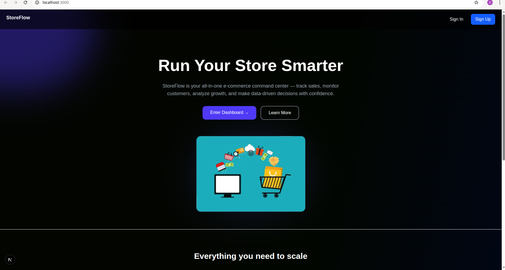

  

  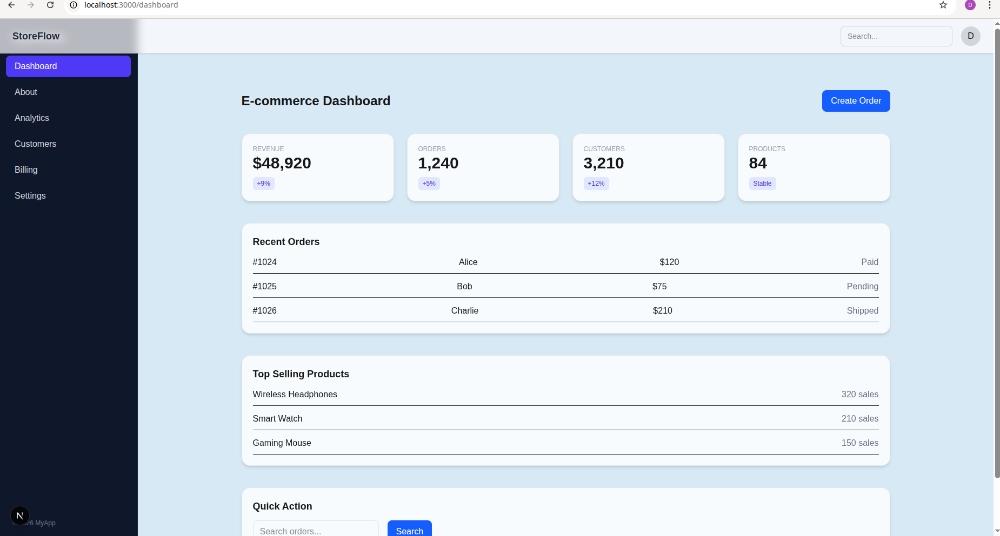

  

  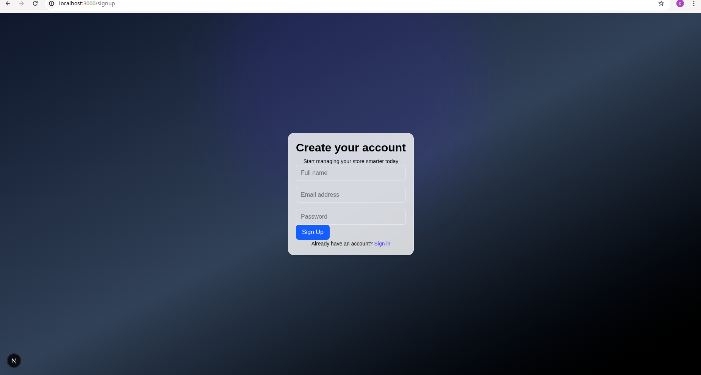

  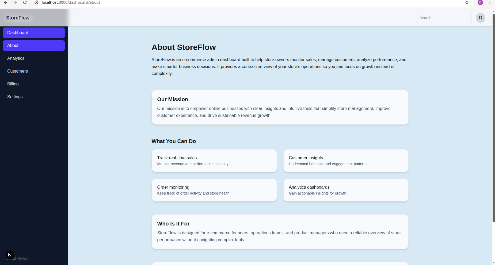

  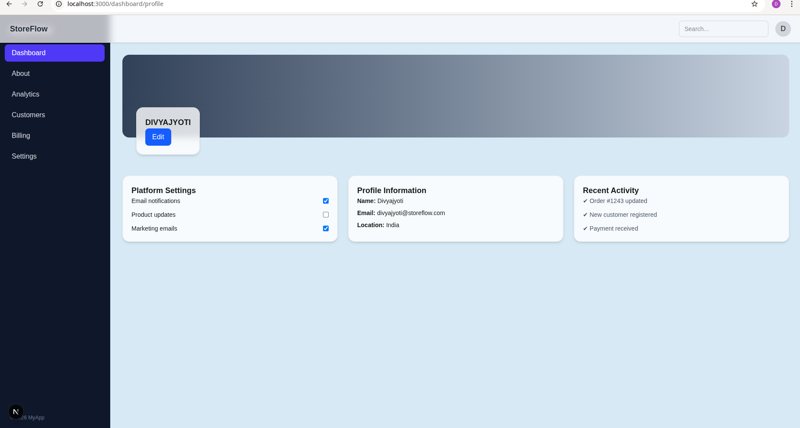

  

  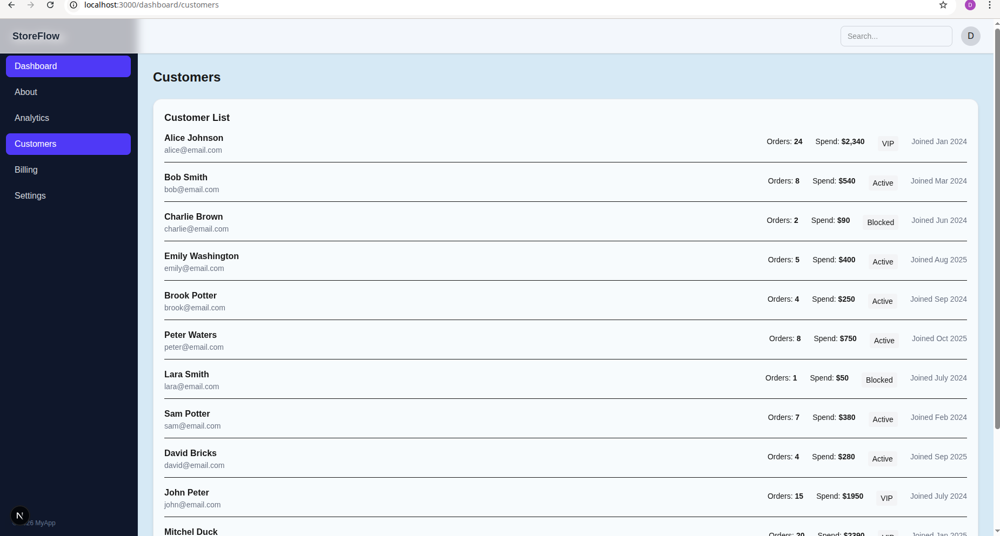

  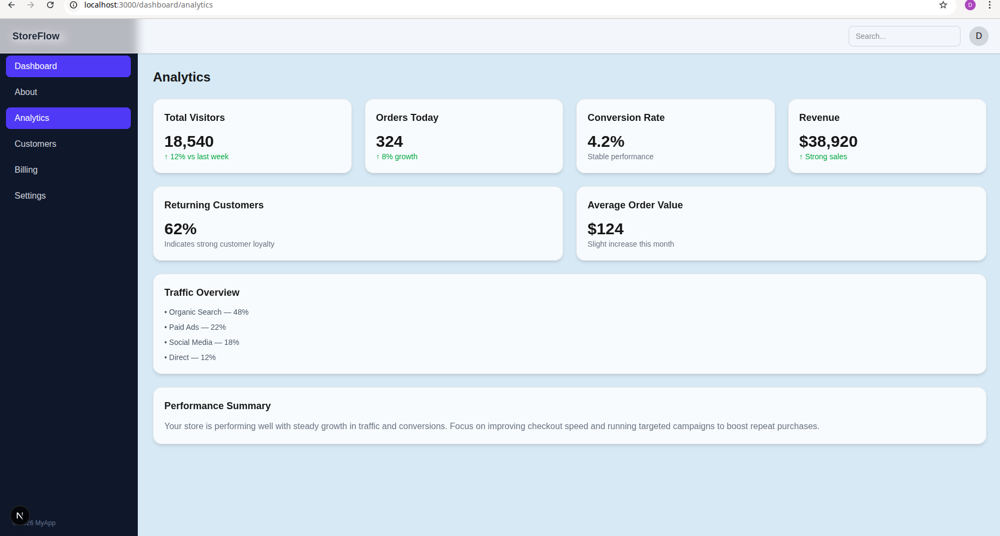

  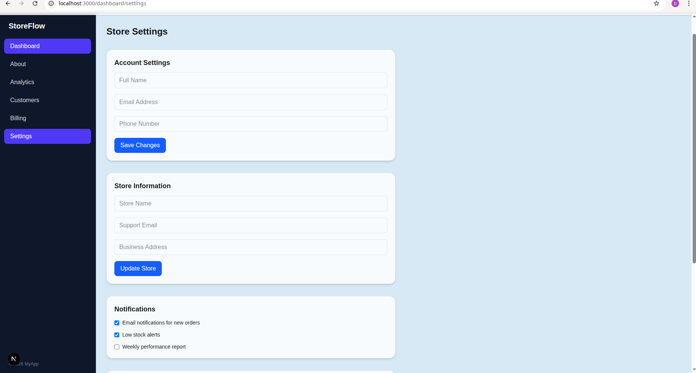

## 📌 WEEK 4 — BACKEND SYSTEMS & PRODUCTION ENGINEERING

**🟦 DAY 1 — BACKEND SYSTEM BOOTSTRAPPING & LIFECYCLE**

**🟩 DAY 2 — DATA DESIGN & QUERY PERFORMANCE (NON-CRUD)**

**🟨 DAY 3 — QUERY PIPELINES & FAILURE-SAFE APIs**

**🟥 DAY 4 — API DEFENSE & INPUT CONTROL**

**🟪 DAY 5 — ASYNC WORKERS, OBSERVABILITY & RELEASE READINESS**