# LearnRush

This repository contains the day wise deliverables 

## 📌 Week 1 — Engineering Mindset Bootcamp

**🟦 DAY1 — SYSTEM REVERSE ENGINEERING + NODE & TERMINAL**

~ Sysinfo.js is a script that prints the hostname, available disk space, top 5 open ports, default gateway and count of logged-in users

~ Created 3 shell aliases named gst,files and ports for git status, ls -lha and lsof -i -P -n | grep LISTEN  respectively (Screenshot attached in the folder)

To verify this, run(in terminal):  

alias

type alias_name

Reminder - Before creating aliases, check your current shell by "echo $SHELL"   

<p align="center">
  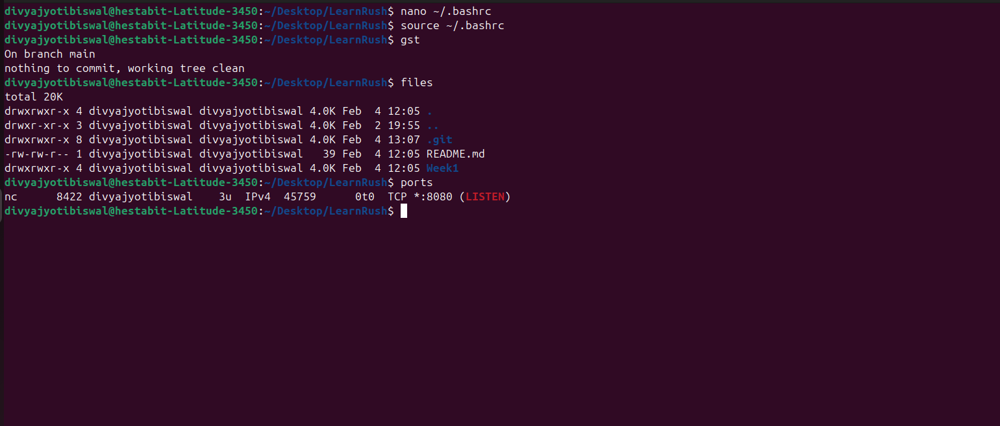
</p>

~ Ran a node program named runtimeMetrics.js and captured its runtime metrices using process.cpuUsage() and process.resourceUsage()

**🟩 DAY2 — NODE CLI & CONCURRENCY**

CLI Tool-Stats.js

Features: 

-Counts lines, characters, and words

-Processes 3 files in parallel using promise.all

-Outputs performance metrics

-Optional: duplicate removals

Command to run : node stats.js --file filename.txt  (this will process the file and add the performance metrices to log)

To process files and remove their duplicate lines : node stats.js --file filename.txt --unique true   (After this the modified files will be added to the output folder)       

**🟨 DAY3 — GIT MASTERY (RESET + REVERT + CHERRY-PICK + STASH)**

~ Syntax error was inserted in the program as a bad commit out of 10 commits and used git bisect to detect the first bad commit  

Command : To start bisect-  git bisect start 

To stop bisect- git bisect reset

~ Created new branch release/v0.1 from older commit using  git checkout -b release/v0.1 commitHash

[commithash can be found using:  git log -oneline]

~ Cherry picked the commits from the main branch to release branch. First switch to release branch

Command used: git cherry-pick 1commitHash 2commitHash....

~ A new commit was made in the program and pushed in the stash and the branch was switched but the commit remained in the stash and finally the commit was restored using git stash apply

~ Created commit graph using: git log --graph --all show

<p align="center">
  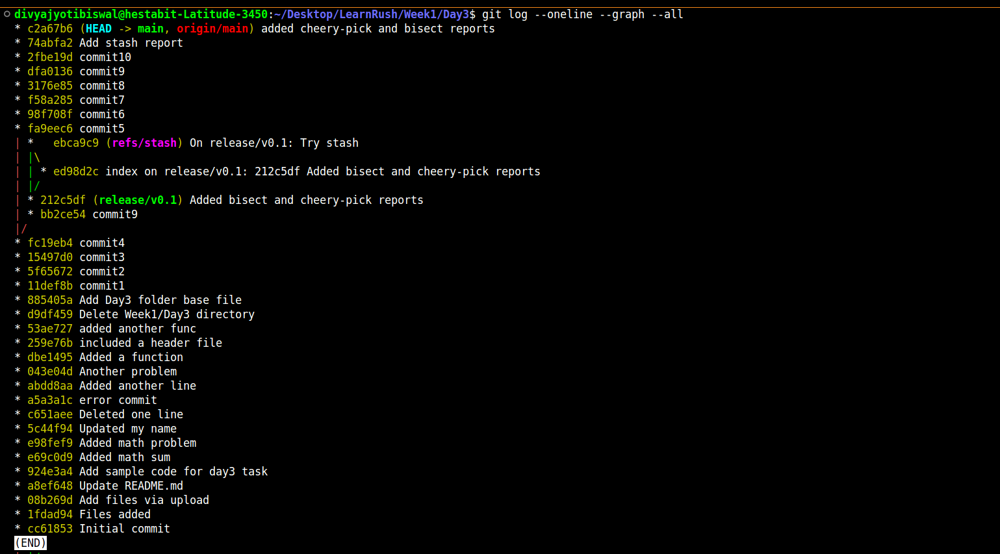
</p>

**🟥 DAY4 — HTTP / API FORENSICS (cURL + POSTMAN)**

~ Logged the response headers into curl-headers.txt using:  curl -I https://api.github.com/users/octat > curl-headers.txt

~ Analyzed paginated responses of 3 pages and link headers by fetching https://api.github.com/users/octocat/repos?page=1&per_page=5

Conclusion: Logged each pages's relation with other pages. However Page3 contains an empty body because the last relation pointing to page2 confirms that page2 is the final page with results and page3 is beyond the dataset.

~ Created and exported that collection to test *GitHub user endpoint  *Repositories across pages

~ Server.js is build to return timestamp,request headers and maintain counter in memory using endpoints: /ping,/headers and /count respectively

To test run: http://localhost:3000/ping

http://localhost:3000/headers

http://localhost:3000/count

**🟪 DAY5 — AUTOMATION & MINI-CI PIPELINE**

~ healthcheck.sh pings your sever every 10sec and also log the timestamps during the failure into the logs folder  

Check private ip address of sever: ip a OR hostname -I

For private ip address of sever: curl ifconfig.me

~ Created pre-commit hook using Husky which checks that .env file does not exist in git, Js is formatted and ensure log files are ignored.

<p align="center">
  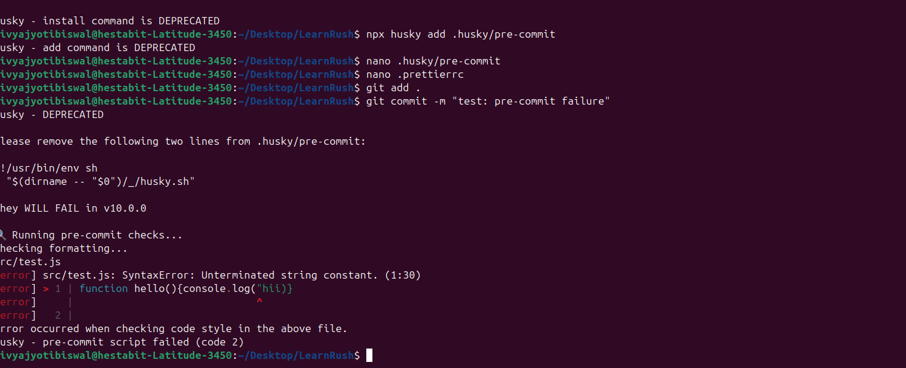
</p>

<p align="center">
  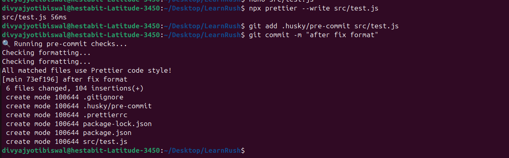
</p>

~ Generated archive: bundle-<timestamp>.zip which includes source code, logs, docs and SHA1 checksums  (To create checksum file: sha1sum src/* > checksums.sha1)

Commands to run build bundle : TIMESTAMP = $(date +%Y%m%d%H%M%S)      

#to generate timestamp:  zip -r bundle -$TIMESTAMP.zip src logs docs checksum.sha1

~ Scheduling to run healthcheck.sh to run every 5 min using cron. To edit crontab run : crontab -e but first make the healthcheck.sh executable using chmod +x healthcheck.sh

<p align="center">
  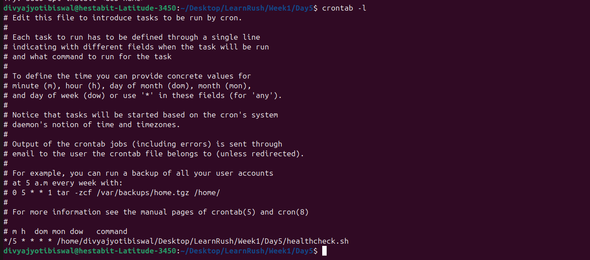
</p>

## 📌 Week 2 — Frontend (HTML, CSS, JS)

**🟦 DAY1 – HTML5 + Semantic Layout**

### Exercise

Built a Blog Page using only semantic HTML (no CSS).

### Key Learnings

- Importance of semantic tags like `header`, `nav`, `main`, `section`, `article`, `aside`, and `footer`
- How semantic HTML improves accessibility and SEO
- Structuring content without relying on generic containers
- Basics of building accessible forms
- Understanding document flow before applying styles

### Notes

- No CSS was used — focus was on structure and semantics.
- Accessibility considerations were included where applicable.

**🟩 DAY2 – CSS Layout Mastery (Flexbox + Grid)**

### Exercise

Replicated a UI screenshot provided by mentor using Flexbox and CSS Grid.

### Key Learnings

- Difference between Flexbox (1D layout) and Grid (2D layout)
- Building responsive layouts without frameworks
- Handling spacing, alignment, and layout flow
- Importance of mobile-first design strategy
- Practical understanding of CSS responsiveness

### Notes
- Focus was on layout techniques using Flexbox and Grid.
- Responsiveness tested across different screen sizes.

<p align="center">
  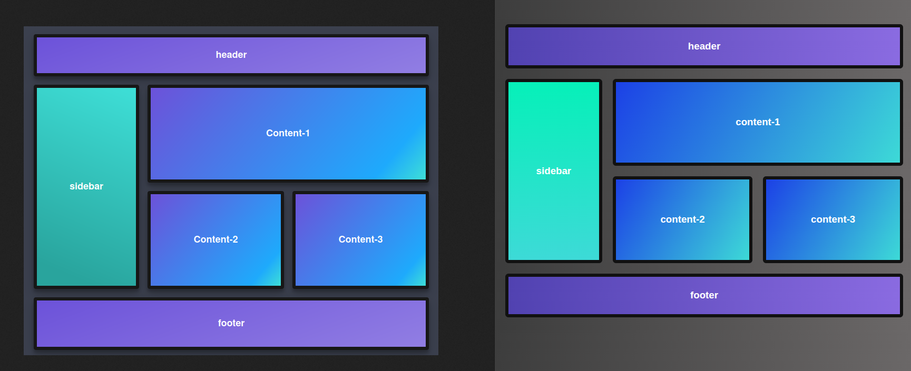
</p>

**🟨 DAY3 – JavaScript ES6 + DOM Manipulation**

### Exercise

Built an interactive FAQ accordion using JavaScript (click to expand).

### Key Learnings

- Writing cleaner code using ES6 features
- Understanding event-driven programming
- Selecting and updating DOM elements dynamically
- Managing UI state using JavaScript
- Improving interactivity without external libraries

### Notes

- Focus was on core JavaScript fundamentals and DOM APIs.
- No frameworks were used — pure JavaScript implementation.

<p align="center">
  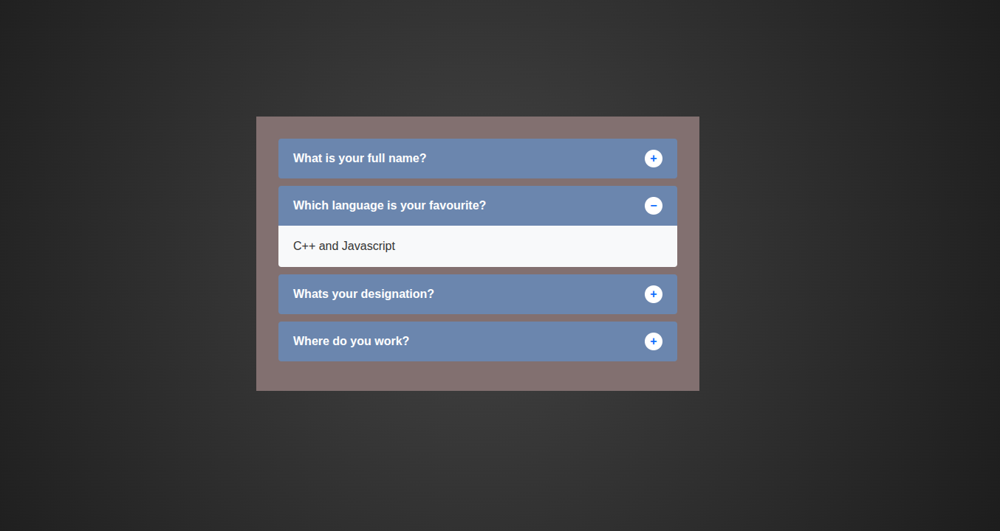
</p>

**🟥 DAY4 – JS Utilities + LocalStorage Mini-Project**

### Exercise
Built a Todo App with LocalStorage persistence.

Features:
- Add tasks
- Edit tasks
- Delete tasks
- Add sticky notes
- Persist data after refresh

### Key Learnings

- Structuring reusable utility functions
- Persisting application state in the browser
- Debugging JavaScript effectively using DevTools
- Handling runtime errors gracefully
- Building small stateful applications without frameworks

### Notes

- Focus was on building a functional mini-project with persistence.
- Emphasis on clean utility functions and debugging workflow.

<p align="center">
  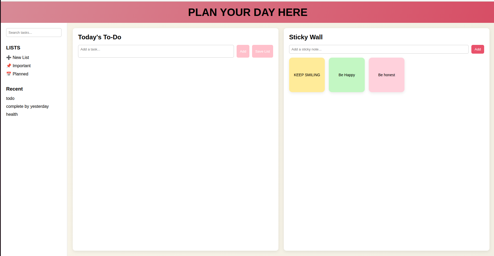
</p>

**🟪 DAY5 – Capstone UI + JS Project**

### Exercise

Built a mini “E-commerce product listing page”.

### Key Learnings

- Fetching and rendering API data dynamically
- Managing UI state with search and sorting
- Structuring a multi-page frontend project
- Building responsive layouts
- Integrating all frontend fundamentals into a single project

### Notes

- Focus was on combining layout, interactivity, and data fetching.
- Emphasis on clean UI and responsiveness.

<p align="center">
  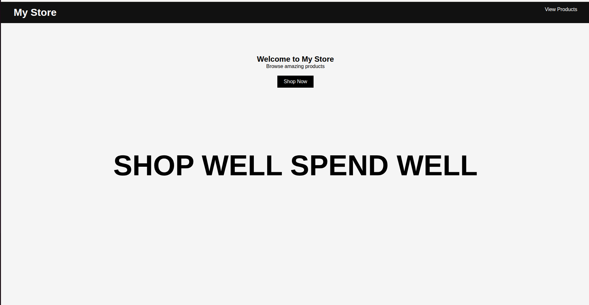
</p>


<p align="center">
  
</p>


<p align="center">
  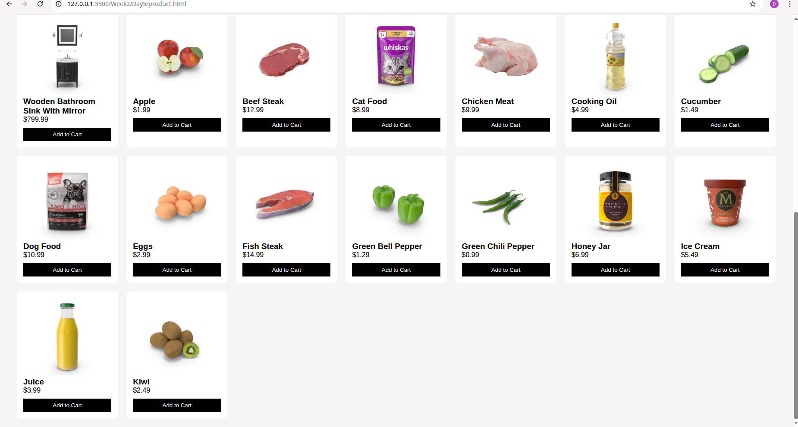
</p>

## 📌 Week 3 – Frontend Advanced

**🟦 DAY1 — TailwindCSS + UI System Basics**

### Exercise

Built a Dashboard Layout skeleton including header and sidebar.

### Key Learnings

- Setting up Tailwind in a Next.js environment
- Using utility-first styling effectively
- Structuring reusable UI components
- Understanding layout composition with header and sidebar
- Working with custom design tokens via theme configuration

**🟩 DAY2 — Tailwind Advanced + Component Library**

### Exercise

Built a component library using reusable UI components and reused the Day 1 sidebar and header.

Components created in:
/components/ui/

- Button.jsx
- Input.jsx
- Card.jsx
- Badge.jsx
- Modal.jsx

### Key Learnings

- Designing reusable UI components
- Applying atomic design concepts
- Managing layout with Tailwind utilities
- Passing props for flexible component behavior
- Structuring a scalable component library

**🟨 DAY3 — Next.js Routing + Layout System**

### Exercise

Built a multi-page application structure using routing and layouts.

Pages created:
- `/` (landing page)
- `/about`
- `/dashboard`
- `/dashboard/profile`

Used the Day 2 complete UI to create static pages and implement routing and layout system.

### Key Learnings

- Understanding file-based routing in Next.js
- Creating nested layout hierarchies
- Sharing navigation across pages
- When to use Client vs Server components
- Structuring scalable multi-page applications

**🟥 DAY4 — Dynamic UI + Image Optimization**

### Exercise

Built a responsive landing page similar to a SaaS product page using the codebase completed up to Day 3.

Sections included:
- Hero section
- Features grid
- Testimonials (cards)
- Footer

Applied Tailwind classes for responsiveness and implemented on-page SEO tags.

### Key Learnings

- Optimizing images for performance using Next.js
- Building responsive UI with Tailwind utilities
- Improving SEO through proper metadata and structure
- Structuring landing pages for clarity and conversion
- Enhancing UI with subtle animations

**🟪 DAY5 — Capstone Mini Project (No backend)**

### Exercise

Built a full multi-page UI using Next.js and Tailwind CSS without a backend.


<p align="center">
  
</p>


<p align="center">
  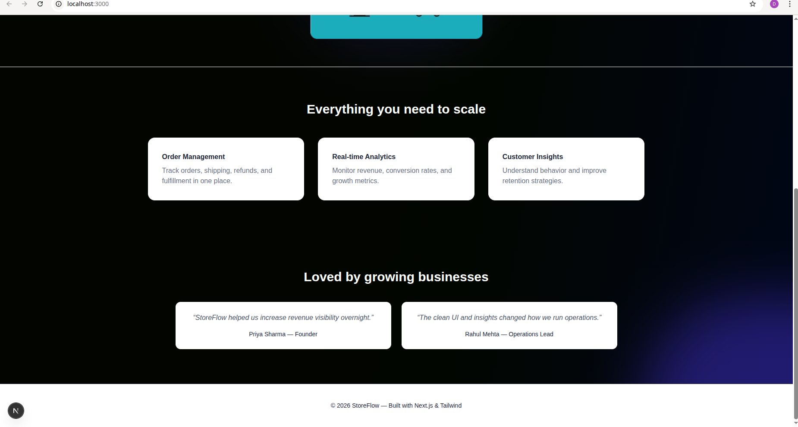
</p>


<p align="center">
  
</p>


<p align="center">
  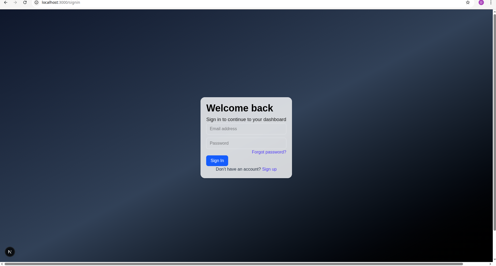
</p>


<p align="center">
  
</p>


<p align="center">
  
</p>


<p align="center">
  
</p>


<p align="center">
  
</p>


<p align="center">
  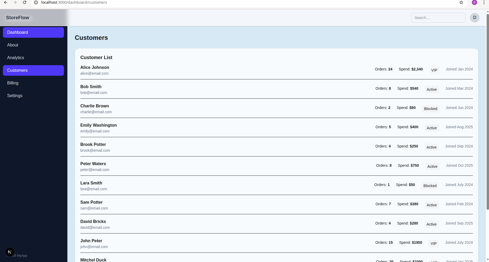
</p>


<p align="center">
  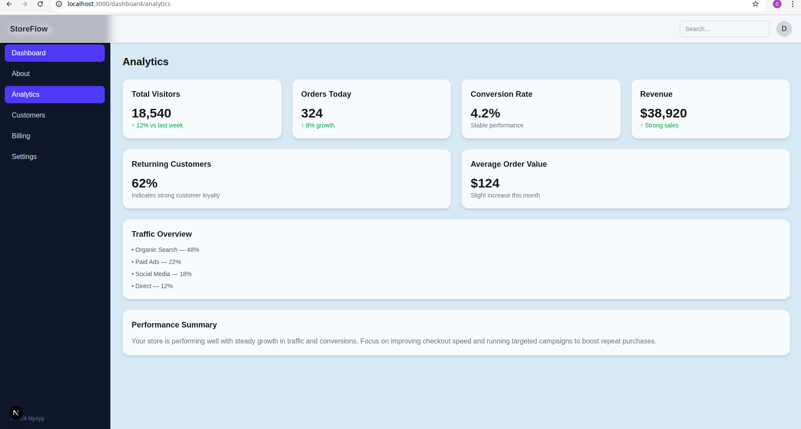
</p>


<p align="center">
  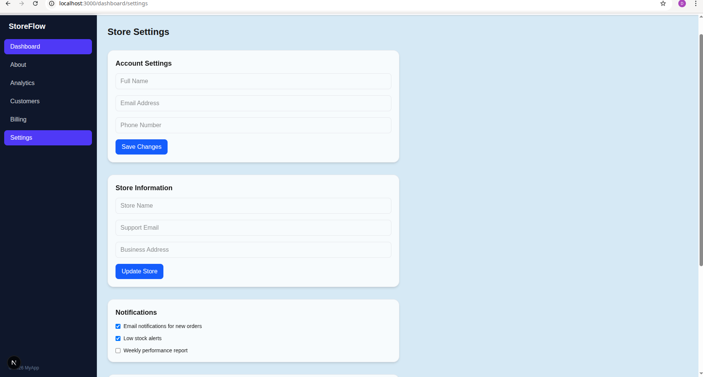
</p>


## 📌 WEEK 4 — BACKEND SYSTEMS & PRODUCTION ENGINEERING

**🟦 DAY 1 — BACKEND SYSTEM BOOTSTRAPPING & LIFECYCLE**

### Exercise

Built a production-style backend structure using Node.js and Express with a controlled application startup lifecycle.

mplemented a modular backend architecture with dedicated loaders for application and database initialization.

Core components created:

/src/loaders/app.js — Initializes Express app, middlewares, and routes

/src/loaders/db.js — Handles database connection

/src/utils/logger.js — Centralized logging system

ARCHITECTURE.md — Documentation explaining backend architecture

Implemented environment-based configuration loading supporting:

.env.local

.env.dev

.env.prod

Added structured startup logs to track system initialization including:

Server startup

Database connection

Middleware loading

Route registration

### Key Learnings

Understanding the Node.js runtime lifecycle beyond the event loop

Designing environment-driven backend bootstrapping

Implementing controlled startup sequences

Structuring backend systems using modular architecture

Creating config loaders for environment isolation

Implementing structured logging using Winston/Pino

Understanding Node.js clustering concepts

Learning how production systems orchestrate dependencies during startup

Designing scalable backend folder structures used in real-world backend services

**🟩 DAY 2 — DATA DESIGN & QUERY PERFORMANCE (NON-CRUD)**

### Exercise

Designed optimized MongoDB schemas for Account and Order systems focusing on performance for read-heavy workloads rather than simple CRUD operations.

Implemented schema features such as validation, indexing, and computed fields to improve data integrity and query performance.

Models created:

/models/Account.js

/models/Order.js

Repository layer implemented following the Repository Pattern to abstract database operations from business logic.

Repository files:

/repositories/account.repository.js

/repositories/order.repository.js

Schema features implemented:

Pre-save hook for password hashing or data preprocessing

Virtual fields such as computed values (e.g., fullName)

Compound index for optimized queries
{ status: 1, createdAt: -1 }

Field validation and transformations

Pagination implementation for efficient data retrieval

Additionally analyzed index performance using MongoDB Compass to understand query cost and index utilization.

<p align="center">
  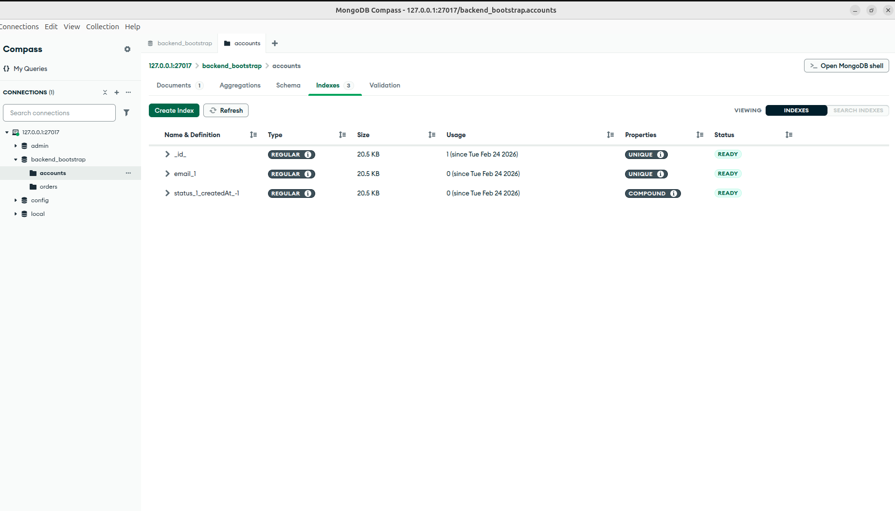
</p>

<p align="center">
  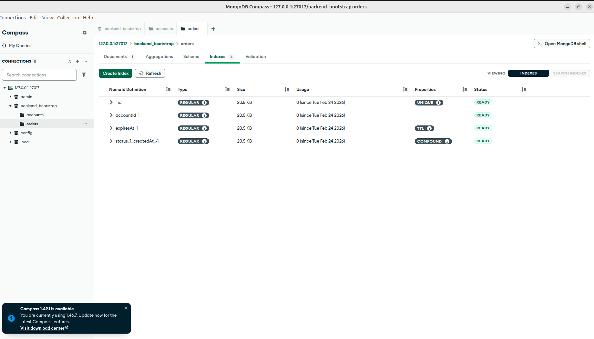
</p>

### Key Learnings
 
Designing schemas optimized for read-heavy systems

Understanding embedded vs referenced data models

Implementing pre-save hooks for data preprocessing

Creating virtual fields for computed data

Implementing compound indexes to optimize query performance

Understanding TTL indexes for automatic data lifecycle management

Using sparse and compound indexes to optimize storage and query speed

Learning query cost analysis using MongoDB Compass

Implementing pagination strategies (skip/limit vs cursor-based pagination)

Applying the Repository Pattern to separate database logic from application logic

Structuring scalable backend data layers for production applications


**🟨 DAY 3 — QUERY PIPELINES & FAILURE-SAFE APIs**

### Exercise

Built a Product API implementing a layered backend architecture with Controller → Service → Repository flow and advanced querying capabilities.

Implemented a dynamic query engine to support complex filtering, searching, sorting, and pagination for product data.

Core files created:

/controllers/product.controller.js

/services/product.service.js

/middlewares/error.middleware.js

QUERY-ENGINE-DOC.md

API features implemented:

Dynamic search engine using regex and logical conditions (OR / AND)

Filtering system using query parameters

Sorting support for fields such as price or creation date

Pagination for efficient large dataset retrieval

Example API query:

GET /products?search=phone&minPrice=100&maxPrice=500&sort=price:desc&tags=apple,samsung

Implemented soft delete functionality to safely remove records without permanently deleting them.

Soft delete behavior:

DELETE /products/:id

Instead of deleting the record, the system sets:

deletedAt = timestamp

Data retrieval supports optional inclusion of deleted records:

GET /products?includeDeleted=true

Implemented global error handling middleware to standardize API responses across the application.

Error responses follow a unified format:

{
  success: false,
  message: "Error message",
  code: "ERROR_CODE",
  timestamp: "ISO date",
  path: "/api/products"
}

### Key Learnings

Understanding Controller → Service → Repository architecture flow

Building dynamic API query engines for complex filtering

Implementing regex search with logical OR/AND query conditions

Designing APIs that support filtering, sorting, and pagination

Implementing soft deletion strategies for safer data management

Understanding controlled data lifecycle management

Designing failure-safe APIs with centralized error handling

Implementing typed errors and error codes

Creating global error middleware for consistent API responses

Building scalable APIs capable of handling complex client queries

**🟥 DAY 4 — API DEFENSE & INPUT CONTROL**

### Exercise

Implemented security protections and input validation mechanisms to reduce API attack surfaces and enforce strict request validation.

Built middleware layers responsible for sanitizing incoming requests, validating payloads, and enforcing global API security policies.

Core files created:

/middlewares/validate.js

/middlewares/security.js

SECURITY-REPORT.md

Implemented validation schemas for User and Product APIs to ensure incoming data follows strict structure and type rules before reaching application logic.

Validation includes:

Required fields enforcement

Data type validation

String length limits

Input transformation and sanitization

Global security protections added to the application:

Helmet for secure HTTP headers

CORS policy to control cross-origin requests

Rate limiting using express-rate-limit

Payload size limits to prevent abuse

Query sanitization to protect against injection attacks

Security middleware protects APIs from common vulnerabilities including:

NoSQL Injection

Cross-Site Scripting (XSS)

HTTP Parameter Pollution

Manual security testing was conducted to simulate potential attack scenarios and verify the system's protection mechanisms.

### Key Learnings

Understanding API attack surfaces and how to reduce them

Implementing schema-based validation using JOI or Zod

Building reusable validation middleware for request bodies

Protecting APIs against NoSQL injection attacks

Preventing Cross-Site Scripting (XSS) through input sanitization

Understanding and preventing HTTP parameter pollution

Implementing rate limiting to protect APIs from abuse and brute-force attacks

Using Helmet to add secure HTTP headers

Configuring CORS policies for controlled resource sharing

Enforcing payload size limits to prevent large request abuse

**🟪 DAY 5 — ASYNC WORKERS, OBSERVABILITY & RELEASE READINESS**

### Exercise

Implemented asynchronous background processing, structured logging, and production-ready backend tooling to simulate real-world backend deployment practices.

Developed a background job system using BullMQ to handle tasks outside the main request-response cycle.

Core files created:

/jobs/email.job.js

/utils/tracing.js

/logs/*.log

DEPLOYMENT-NOTES.md

Postman Collection Export

The background job system processes tasks such as email notifications or report generation using a queue-based architecture.

Queue system features implemented:

BullMQ job queue

Retry mechanism for failed jobs

Exponential backoff strategy

Worker process for background job execution

Job logging for monitoring execution

Implemented request tracing to improve observability and debugging across API requests.

Each incoming request is assigned a unique identifier:

X-Request-ID

This request ID is attached to logs, enabling developers to trace the lifecycle of a request across services and logs.

Structured logging ensures logs can be correlated with specific requests.

Example log grouping:

[Request-ID: abc123]
User request received
Product query executed
Response sent successfully

API documentation was generated using Swagger or Postman Collection, enabling easier API testing and integration for developers.

The documentation includes:

Organized endpoint folders

Environment variables

Request examples

Response formats

Prepared a deployment-ready production folder containing configuration files required for running the application in production environments.

Production setup includes:

PM2 ecosystem configuration

Environment variable template

Deployment notes

Example production files:

prod/
  ecosystem.config.js
  .env.example

### Key Learnings

Designing asynchronous background job systems

Understanding job queues using BullMQ and Redis

Implementing retry strategies and exponential backoff for job reliability

Building worker processes to handle background tasks

Implementing structured logging patterns

Using correlation IDs (X-Request-ID) for request tracing

Understanding observability in backend systems

Designing APIs with traceable request lifecycle logs

Creating developer-friendly API documentation using Swagger or Postman

Structuring backend systems for production deployment

Preparing backend services for PM2 process management

Learning release readiness practices used in real production systems


## 📌 Week 5 - Server Side Foundations with Docker & DevOps Basics

**🟦 DAY 1 — Docker Fundamentals + Linux Internals**

### Overview

This exercise introduces the fundamentals of Docker and basic Linux operations inside a container. The goal is to understand how containers work internally and how to inspect their environment using standard Linux tools.

### Concepts Covered

### 1. Docker Images

A **Docker image** is a read-only template used to create containers.
It includes:

* Application code
* Runtime
* System libraries
* Dependencies

Images are built using a **Dockerfile**.

---

### 2. Containers

A **container** is a running instance of an image.

Characteristics:

* Lightweight
* Isolated environment
* Shares host kernel
* Fast startup

---

### 3. Volumes

Volumes allow persistent data storage outside the container filesystem.

Benefits:

* Data survives container restarts
* Enables data sharing between containers
* Useful for logs, databases, and uploads

---

## 4. Docker Networks

Docker networks enable communication between containers.

Common types:

* bridge (default)
* host
* overlay

---

### Running the Container

Build the image:

```bash
docker build -t node-docker-demo .
```

Run the container:

```bash
docker run -d -p 3000:3000 --name node-demo node-docker-demo
```

Check running containers:

```bash
docker ps
```

---

### Entering the Container

To access the container shell:

```bash
docker exec -it node-demo /bin/sh
```

This allows you to interact with the container like a Linux system.

---

### Exploring Linux Inside the Container

### List Files

```bash
ls
ls -la
```

Purpose:

* View application files
* Inspect container filesystem

---

### Check Running Processes

```bash
ps
```

Shows:

* Running processes
* PID
* Command

Example output:

```
PID   USER     COMMAND
1     node     node app.js
```

---

### Monitor Processes

```bash
top
```

Displays:

* CPU usage
* Memory usage
* Active processes

---

### Check Disk Usage

```bash
df -h
```

Displays disk space usage of the container filesystem.

---

### View Logs

Exit container and run:

```bash
docker logs node-demo
```

Logs show application output and errors.

### Key Learnings

* Containers behave like lightweight Linux environments.
* Each container runs isolated processes.
* You can inspect and debug containers using normal Linux commands.
* Docker simplifies application packaging and deployment.

**🟩 DAY 2 — Docker Compose + Multi-Container Apps**

### Overview

This project demonstrates running a **multi-container full-stack application** using Docker Compose.

The application consists of three services:

* **React Client** – Frontend UI
* **Node Server** – Backend API
* **MongoDB** – Database

All services are started using a **single command**:

```
docker compose up -d
```

Docker Compose automatically creates a network so the containers can communicate with each other.

---

### Services

### 1. Client (React)

The client is a React application that provides the user interface.

**Container Details**

* Port: `3000`
* Directory: `/client`
* Built using a Dockerfile

Access in browser:

```
http://localhost:3000
```

Responsibilities:

* UI rendering
* Sending API requests to the backend
* Displaying data from the server

---

### 2. Server (Node.js)

The server is a Node.js backend responsible for handling API requests and interacting with the database.

**Container Details**

* Port: `5000`
* Directory: `/server`

Environment variable used for MongoDB connection:

```
MONGO_URI=mongodb://mongodb:27017/mydatabase
```

Responsibilities:

* Handle API routes
* Process business logic
* Read/write data from MongoDB

---

### 3. MongoDB

MongoDB is used as the database for storing application data.

**Container Details**

* Image: `mongo`
* Port: `27017`

A Docker volume is used to persist database data:

```
mongo-data:/data/db
```

This ensures that **data is not lost when containers restart**.

---

### Docker Networking

Docker Compose automatically creates a **bridge network** for all services.

This allows containers to communicate using **service names as hostnames**.

Example:

```
mongodb://mongodb:27017/mydatabase
```

Here:

* `mongodb` → service name
* `27017` → MongoDB port

The Node server connects to MongoDB using this internal network.

---

### Persistent Storage

A Docker volume is used for MongoDB:

```
mongo-data
```

Benefits:

* Data persists across container restarts
* Prevents database data loss
* Separates data from container lifecycle

---

### Logs

To view logs from all services:

```
docker compose logs
```

Logs for specific services:

```
docker compose logs client
docker compose logs server
docker compose logs mongodb
```

---

### Running the Application

Start all services:

```
docker compose up -d
```

Check running containers:

```
docker compose ps
```

Stop services:

```
docker compose down
```


### Key Learnings

* Docker Compose simplifies running **multi-container applications**
* Containers communicate using **internal service names**
* Volumes allow **persistent storage**
* Logs help monitor service behavior

---

### Result

Using Docker Compose, the entire stack can be deployed with:

```
docker compose up -d
```

This launches:

* React frontend
* Node backend
* MongoDB database

All running in separate containers but connected through Docker networking.

**🟨 DAY 3 — NGINX Reverse Proxy + Load Balancing**

### Overview

This exercise demonstrates how to use **NGINX inside Docker** as a reverse proxy to route incoming requests to multiple backend containers. It also simulates **load balancing** by running two backend instances and distributing traffic between them.

The reverse proxy forwards API requests from the client to backend services running inside the Docker network.

---

### Architecture

Client Request
↓
NGINX Reverse Proxy
↓
Load Balancer (Round Robin)
↓
Backend Instance 1
Backend Instance 2

NGINX sits at the front and distributes requests to backend containers.

---

### Reverse Proxy

A **reverse proxy** is a server that receives requests from clients and forwards them to backend servers.

Benefits:

* Hides backend infrastructure
* Improves security
* Centralizes routing
* Enables load balancing

In this setup, NGINX listens for incoming requests and forwards `/api` requests to backend containers.

---

### Load Balancing

Load balancing distributes traffic across multiple backend instances to improve performance and reliability.

This exercise uses **round-robin load balancing**, which is the default behavior in NGINX.

Example distribution:

Request 1 → Backend 1
Request 2 → Backend 2
Request 3 → Backend 1
Request 4 → Backend 2

This ensures that requests are evenly distributed.

---

### Backend Replicas

Two backend containers are used to simulate a scalable system.

Example instances:

* backend1
* backend2

Both services un the same application and listen on:

Port 3000

NGINX routes incoming API requests to these containers.

Request Routing

NGINX is configured to forward requests from /api to the backend service group.

Example request:

http://localhost/api

NGINX receives the request and forwards it to one of the backend containers using round-robin selection.

Running the Application

Start the system using Docker:

docker compose up -d

Check running containers:

docker ps
Testing Load Balancing

Open:

http://localhost/api

Refresh the request multiple times.

Requests should be handled alternately by backend1 and backend2.

You can confirm using container logs:

docker logs backend1
docker logs backend2

### Key Learnings

NGINX can run inside Docker containers

Reverse proxies route external requests to internal services

Load balancing distributes traffic across multiple containers

Docker networking allows containers to communicate using service names

**🟥 DAY 4 — SSL + Self-Signed + mkcert + HTTPS**

### Overview

This exercise demonstrates how to enable **HTTPS for a local Docker-based application** using **self-signed certificates generated with mkcert** and terminate SSL at an **NGINX reverse proxy**.

The setup ensures that all HTTP requests are redirected to HTTPS and that the application is accessible securely through a local domain with a browser lock icon.

---

### Objective

* Understand **SSL/TLS fundamentals**
* Generate local trusted certificates using **mkcert**
* Configure **NGINX for HTTPS termination**
* Redirect **HTTP → HTTPS**
* Verify HTTPS with a browser lock icon

---

### SSL/TLS Fundamentals

**SSL/TLS** encrypts communication between a client and server.

Benefits:

* Encrypts network traffic
* Protects sensitive data
* Prevents man-in-the-middle attacks
* Verifies server identity

In this setup, **NGINX handles TLS encryption**, while backend services run internally over HTTP.

---

### mkcert

`mkcert` is a tool that creates **locally trusted development certificates**.

Unlike normal self-signed certificates, mkcert installs a **local Certificate Authority (CA)** so browsers trust the generated certificates.

This allows the browser to display the **secure lock icon** without warnings.

---

### Generating Certificates

Install mkcert and create local certificates.

Initialize local CA:

```
mkcert -install
```

Generate certificates for local domain:

```
mkcert local.dev
```

Generated files:

```
local.dev.pem
local.dev-key.pem
```

These certificates are used by NGINX to enable HTTPS.

---

### HTTPS Termination with NGINX

NGINX acts as the **SSL termination point**.

Responsibilities:

* Accept HTTPS traffic
* Decrypt TLS
* Forward requests to backend containers

Traffic Flow:

Client (HTTPS)
↓
NGINX (SSL Termination)
↓
Backend Containers (HTTP)

This improves performance and centralizes security management.

---

### HTTP to HTTPS Redirect

To enforce secure communication, HTTP traffic is automatically redirected to HTTPS.

Example behavior:

```
http://local.dev  →  https://local.dev
```

This ensures all requests use encrypted connections.

---

### Running the System

Start the application stack:

```
docker compose up -d
```

Verify containers:

```
docker ps
```

---

### Testing HTTPS

Open the local domain in your browser:

```
https://local.dev
```

Expected result:

* Browser shows **lock icon**
* HTTPS connection is active
* No security warnings appear

<p align="center">
  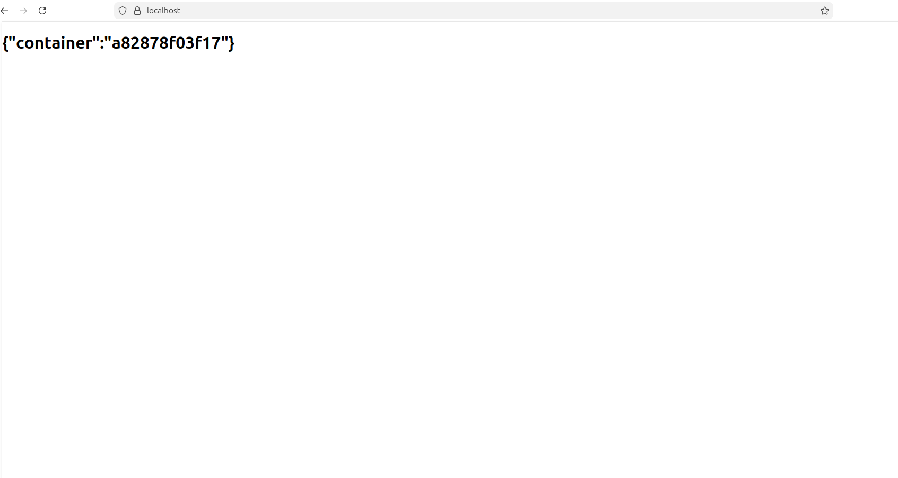
</p>

---

### Verification

Confirm the setup by checking:

* HTTP automatically redirects to HTTPS
* HTTPS loads successfully
* Browser displays secure **lock icon**
* Backend services function normally

---

### Key Learnings

* How SSL/TLS secures web traffic
* How to generate trusted local certificates using **mkcert**
* How to configure **NGINX for HTTPS termination**
* How to enforce secure connections using **HTTP → HTTPS redirects**
* How Docker containers can serve secure applications locally


**🟪 DAY 5 — CI-Style Deployment Automation + Capstone**

### Overview

This capstone project demonstrates how to deploy a **production-style full-stack application using Docker** with automated configuration and reliability features.

The stack includes:

* **Frontend client**
* **Backend API**
* **Database**
* **NGINX reverse proxy**
* **HTTPS support**
---

### Objectives

This exercise focuses on:

* Managing configuration with `.env`
* Using **Docker volumes** for persistent storage
* Using **Compose profiles** for environment control
* Implementing **health checks**
* Configuring **log rotation**
* Creating a **production deployment workflow**

---

### Application Architecture

User Request
↓
NGINX Reverse Proxy (HTTPS)
↓
Backend API
↓
Database

The reverse proxy handles HTTPS termination and routes requests to backend services running inside the Docker network.

---

### Environment Configuration

Application secrets and configuration are stored in a `.env` file.

Example:

```
NODE_ENV=production
MONGO_URI=mongodb://mongodb:27017/appdb
API_PORT=3000
```

Important:

The `.env` file **must not be committed to version control**.

Add it to `.gitignore`.

This keeps secrets such as database credentials and API keys secure.

---

### Docker Volumes

Docker volumes are used to persist important application data.

Example use cases:

* Database storage
* Uploaded files
* Logs

Benefits:

* Data persists across container restarts
* Containers remain stateless
* Easy backup and migration

---

### Compose Profiles

Compose profiles allow running specific services depending on the environment.

Example environments:

* development
* production

Production deployment uses:

```
docker compose -f docker-compose.prod.yml up -d
```

This loads the **production configuration** defined in `docker-compose.prod.yml`.

---

### Health Checks

Health checks ensure containers are functioning correctly.

Docker periodically verifies service status and reports unhealthy containers.

Example check:

* Backend API endpoint `/health`
* Database availability

Benefits:

* Early failure detection
* Improved reliability
* Easier orchestration in production systems

---

### Container Restart Policy

Containers are configured with automatic restart policies.

Common policies:

* `always`
* `unless-stopped`

This ensures services remain running even after crashes or system reboots.

---

### Log Rotation

Log rotation prevents containers from generating excessively large log files.

Benefits:

* Prevents disk space exhaustion
* Maintains manageable log sizes
* Supports production monitoring practices

---

### Deployment Script

Deployment can be automated using a script.

Example workflow:

1. Pull latest code
2. Load environment variables
3. Start containers using production compose file
4. Verify container health

Example command:

```
docker compose -f docker-compose.prod.yml up -d
```

This starts the entire application stack in production mode.

---

### Running the Application

Start the production stack:

```
docker compose -f docker-compose.prod.yml up -d
```

Verify running containers:

```
docker ps
```

Check service logs:

```
docker compose logs
```

### Key Learnings

This capstone demonstrates:

* Production container deployment using Docker Compose
* Secure configuration using environment variables
* Persistent storage using Docker volumes
* Service monitoring with health checks
* Automated deployment workflows
* Reverse proxy with HTTPS support


