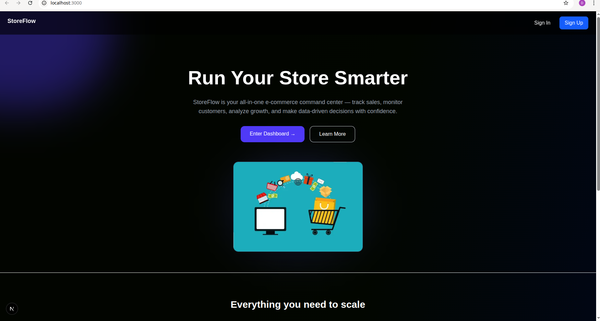
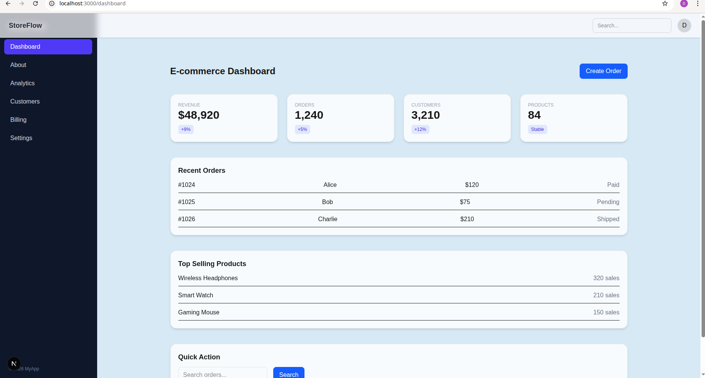
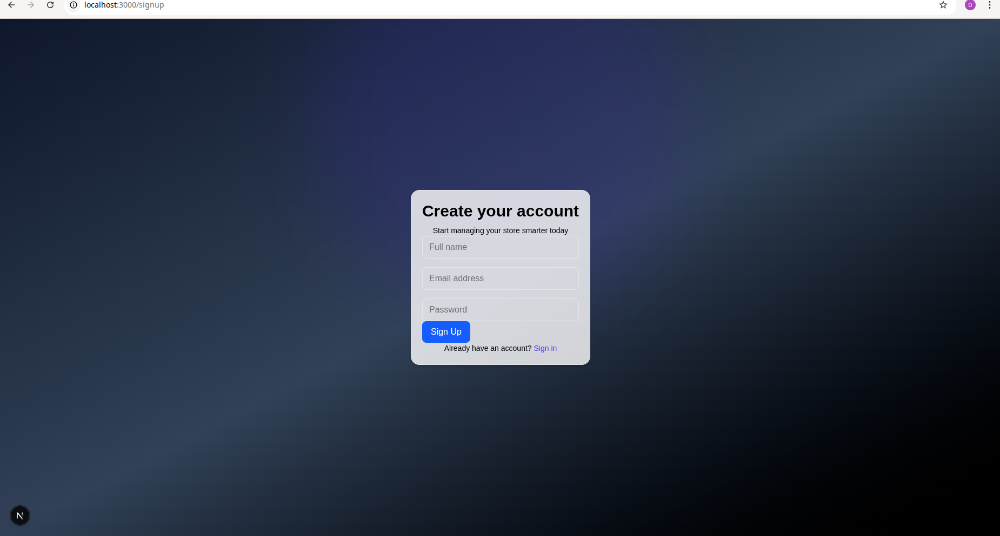
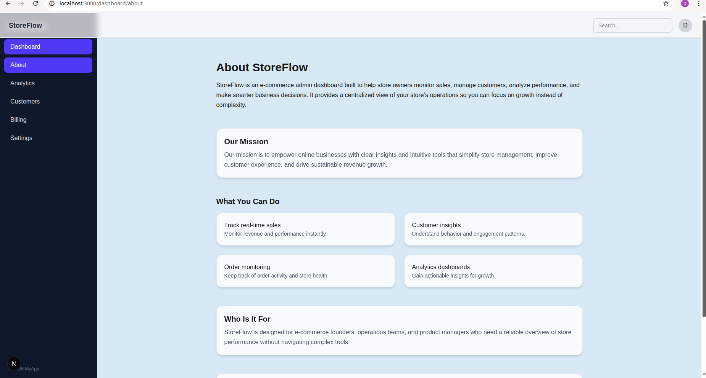
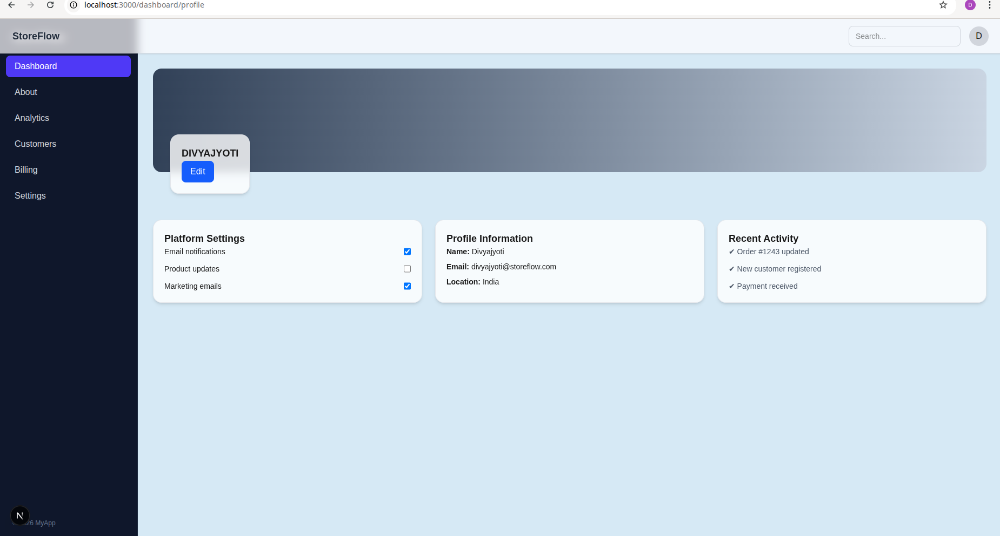
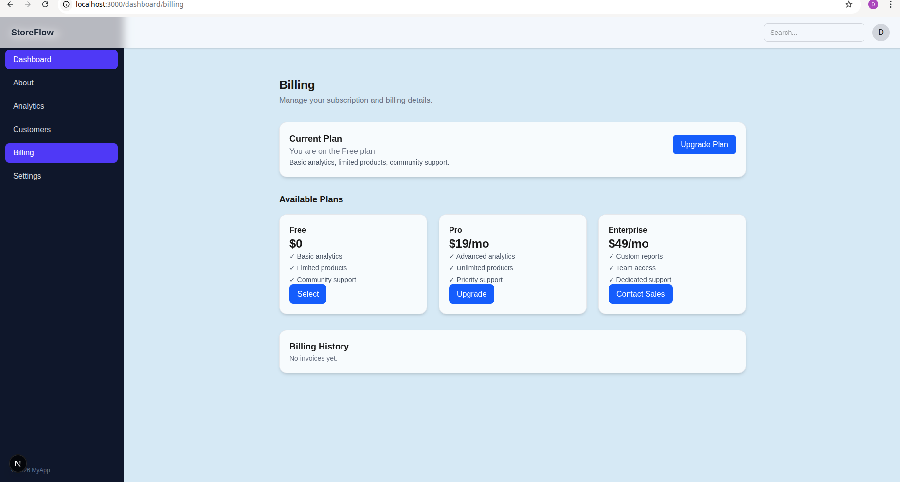

Built a full multi-page UI using Next.js and Tailwind CSS without a backend.

## Folder Structure:
```
Day5/
├── app
│   ├── layout.jsx
│   └── page.jsx
├── dashboard
│   ├── about
│   ├── analytics
│   ├── billing
│   ├── customers
│   ├── layout.jsx
│   ├── page.jsx
│   ├── profile
│   └── settings
├── globals.css
├── next.config.ts
├── package.json
├── package-lock.json
├── postcss.config.mjs
├── public
│   ├── background.png
│   ├── e_commerce.jpg
│   ├── file.svg
│   ├── globe.svg
│   ├── next.svg
│   ├── vercel.svg
│   └── window.svg
├── README.md
└── Screenshots
    ├── About.png
    ├── Analytics.png
    ├── Billing.png
    ├── Customers.png
    ├── Dashboard.png
    ├── LandingPage1.png
    ├── LandingPage2.png
    ├── Profile.png
    ├── Settings.png
    ├── SignIn.png
    └── SignUp.png

```

<p align="center">
  
</p>


<p align="center">
  
</p>


<p align="center">
  
</p>


<p align="center">
  

<p align="center">
  
</p>


<p align="center">
  
</p>


<p align="center">
  
</p>


<p align="center">
  
</p>


<p align="center">
  
</p>


<p align="center">
  
</p>


<p align="center">
  
</p>


## Start the project

First, run the development server:

```bash
npm run dev

```

Open [http://localhost:3000](http://localhost:3000) with your browser to see the result.

